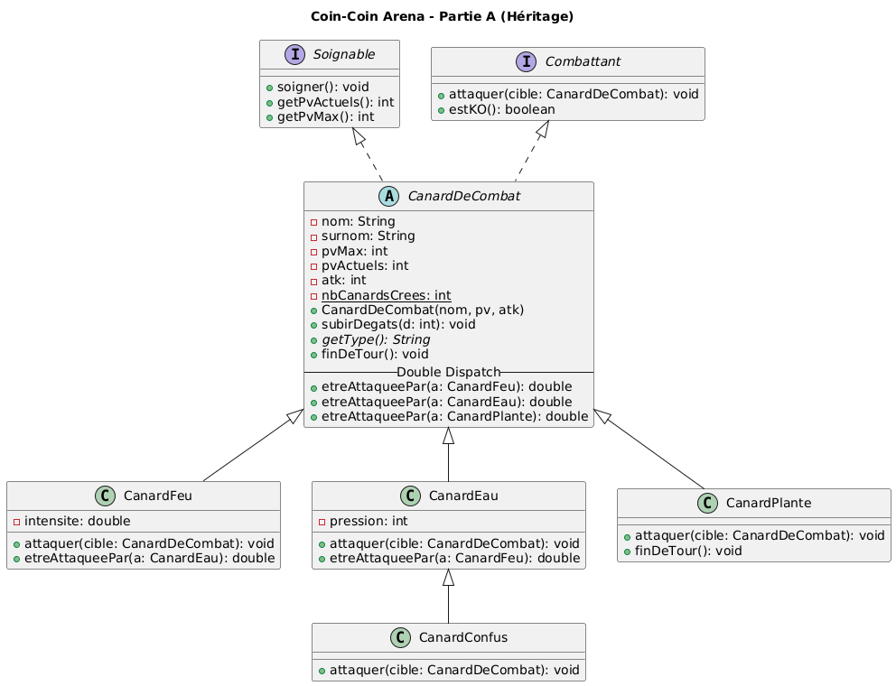
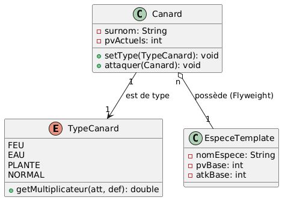

# Projet-Java-Theo_Raban

## Section 1 - Modélisation par héritage

### Architecture globale partie A

### R1 : Duplication des données 
Dans la Partie A, les statistiques de base comme les points de vie maximum, l’attaque ou le nom d’espèce sont stockées directement dans chaque instance de CanardDeCombat. Cela signifie que si l’on crée plusieurs canards d’une même espèce, par exemple plusieurs “Canard Flamme”, chacun possède sa propre copie des mêmes valeurs. Ce fonctionnement entraîne une duplication inutile des données en mémoire et rend le système moins efficace. De plus, si l’on souhaite modifier les statistiques de base d’une espèce, il faudrait modifier chaque instance ou chaque appel constructeur concerné. Le problème est donc un manque de mutualisation des données communes. Cette limite sera corrigée en Partie B grâce à l’introduction d’un objet représentant l’espèce, partagé par tous les canards de ce type.

### R2 : Surcharge vs Redéfinition
La première tentative consistait à surcharger des méthodes getMultiplicateur en fonction du type de la cible. Cependant, la surcharge en Java est résolue à la compilation et dépend uniquement du type déclaré de la variable, pas de son type réel à l’exécution. Ainsi, si la variable cible est déclarée comme CanardDeCombat, le compilateur cherchera une méthode acceptant un CanardDeCombat, même si l’objet réel est un CanardEau ou un CanardFeu. Cette approche ne fonctionne donc pas car elle repose sur un mécanisme statique. Pour résoudre ce problème, il faut utiliser la redéfinition de méthodes, qui est dynamique, ce qui conduit à l’utilisation du double dispatch.

### R3 : Coût du Double Dispatch
Le double dispatch permet d’éviter les conditions de type et les comparaisons de chaînes, ce qui constitue une solution élégante et purement polymorphique. Cependant, il entraîne une forte augmentation du nombre de méthodes à écrire. Avec N types de canards, il faut prévoir N méthodes etreAttaqueePar dans chaque classe. Si un nouveau type est ajouté, il faut modifier la classe mère pour y déclarer la nouvelle méthode, puis éventuellement redéfinir cette méthode dans toutes les sous-classes existantes. Le nombre total de méthodes liées aux multiplicateurs devient proportionnel à N². Cette architecture est propre conceptuellement, mais elle devient lourde et difficile à maintenir lorsque le nombre de types augmente.

### R4 : Utilité des Interfaces
Les interfaces Soignable et Combattant sont utiles même si leurs méthodes existent déjà dans CanardDeCombat. Leur intérêt principal est de permettre une abstraction indépendante de la hiérarchie des canards. Si l’on souhaite ajouter plus tard un robot de combat ou un autre type de combattant qui ne serait pas un canard, il pourra implémenter l’interface Combattant sans hériter de CanardDeCombat. Les interfaces favorisent donc la flexibilité et le respect du principe de programmation orientée interface plutôt qu’orientée classe concrète. Elles permettent d’ouvrir l’arène à d’autres types d’objets sans modifier son code interne.

### R5 : Explosion combinatoire
Le CanardConfus montre une limite importante de l’héritage. Il s’agit d’un CanardEau avec un comportement modifié. Si l’on voulait créer un CanardFeu confus ou un CanardPlante confus, il faudrait créer une nouvelle classe pour chaque combinaison type × comportement. Avec quatre types et trois comportements spéciaux, on obtiendrait déjà douze classes différentes. Ce phénomène est appelé explosion combinatoire. Plus le nombre de variantes augmente, plus la hiérarchie devient complexe et difficile à maintenir. Cela montre que l’héritage n’est pas toujours la solution la plus extensible pour modéliser des comportements combinables.

### R6 : Instanceof vs Méthode de cycle de vie
Dans l’arène, la régénération des canards Plante est gérée par un test instanceof. Ce type de test peut être considéré comme un signe de conception perfectible, car il oblige l’arène à connaître les sous-types concrets. Une alternative plus propre serait de définir une méthode finDeTour dans la classe abstraite CanardDeCombat et de la redéfinir uniquement dans les sous-classes concernées. Ainsi, l’arène appellerait simplement finDeTour sans se soucier du type réel. Cette approche renforcerait l’encapsulation et faciliterait l’ajout futur d’un nouveau type ayant un comportement spécifique en fin de tour, comme un CanardGlace qui perd des points de vie progressivement.

## Section 2 - Refactorisation vers la Composition

### Architecture globale partie B

### R7 : Avantages de l'Enum 
Dans la Partie A, le type d’un canard est déterminé par sa classe. Cela signifie qu’ajouter un nouveau type implique la création d’une nouvelle sous-classe et la modification éventuelle de plusieurs autres classes. Il est également impossible de changer le type d’un canard à l’exécution, car l’héritage fixe le type lors de l’instanciation. En Partie B, le type devient un simple attribut de type Enum. Ajouter un nouveau type consiste uniquement à ajouter une valeur dans l’énumération et à compléter la table des multiplicateurs. Il devient aussi théoriquement possible de modifier le type d’un canard en cours de jeu, car il ne dépend plus de la hiérarchie des classes. Enfin, l’utilisation d’un Enum réduit fortement la nécessité de tests instanceof.

### R8 : Séparation des responsabilités
Dans la Partie A, la table des multiplicateurs est répartie dans de nombreuses méthodes etreAttaqueePar, dispersées dans toutes les sous-classes. La logique est donc éclatée et difficile à visualiser dans son ensemble. En Partie B, toute la logique des multiplicateurs est centralisée dans l’Enum TypeCanard. Cette centralisation rend le système plus lisible et plus facile à maintenir. Si l’on ajoute un nouveau type, il suffit d’ajouter une valeur dans l’Enum et d’adapter la table. Il n’est pas nécessaire de modifier toutes les classes existantes. Cette approche est donc plus maintenable lorsque le nombre de types augmente.

### R9 : Flexibilité du comportement
En Partie B, les statistiques de base sont stockées dans un objet EspeceCanard partagé. Si l’on crée cinquante canards d’une même espèce, il n’existe qu’un seul objet EspeceCanard en mémoire, utilisé par toutes les instances. En Partie A, chaque canard possède sa propre copie des statistiques, ce qui multiplie les données identiques. La Partie B applique donc le pattern Flyweight, qui consiste à partager les données immuables communes entre plusieurs objets afin de réduire l’empreinte mémoire et améliorer la cohérence.

### R10 : Simplification de la table des types
Le principe Open/Closed stipule qu’un système doit être ouvert à l’extension mais fermé à la modification. En Partie A, ajouter un nouveau type oblige à modifier la classe mère et plusieurs sous-classes existantes pour gérer les multiplicateurs. Le système n’est donc pas réellement fermé à la modification. En Partie B, ajouter un nouveau type consiste essentiellement à compléter l’Enum et éventuellement ajouter une nouvelle espèce. La classe Canard reste inchangée. La Partie B respecte donc mieux le principe Open/Closed et offre une architecture plus évolutive.

### R11 : Évolutivité du système
Le test instanceof de la Partie A dépend directement de la hiérarchie des classes. Si l’on supprimait la classe CanardPlante, ce test ne fonctionnerait plus. En Partie B, le test basé sur l’Enum est plus stable, car il repose sur une donnée plutôt que sur une classe concrète. Il est également plus lisible pour un développeur extérieur, car il exprime explicitement une condition sur le type logique du canard. Si les comportements de fin de tour devenaient plus complexes, la meilleure solution serait de déplacer cette logique directement dans l’Enum, en permettant à chaque valeur de définir son propre comportement finDeTour.

### R12 : Conclusion sur le Design
Dans la Partie B, il n’existe plus de sous-classes spécialisées comme CanardConfus. Pour modéliser un comportement spécial sans créer de nouvelles classes, plusieurs solutions sont possibles. On peut ajouter un attribut booléen indiquant l’état du canard, utiliser un Enum représentant différents états ou appliquer le pattern Strategy en définissant une interface ComportementAttaque avec plusieurs implémentations. La solution la plus extensible est le pattern Strategy, car il permet d’ajouter de nouveaux comportements sans modifier la classe principale. Il devient ainsi possible de combiner librement les types et les comportements sans explosion du nombre de classes.

## Section 3 - Comparaison des deux approches

| Critère | Partie A (héritage) | Partie B (composition) |
|----------|--------------------|-------------------------|
| Ajouter un nouveau type (ex. Électrique) | Il faut créer une nouvelle sous-classe, ajouter une méthode `etreAttaqueePar` dans la classe mère, puis redéfinir cette méthode dans les sous-classes concernées. Plusieurs fichiers existants doivent être modifiés. | Il suffit d’ajouter une nouvelle valeur dans l’Enum `TypeCanard` et compléter la table des multiplicateurs. Aucune classe existante n’a besoin d’être modifiée. |
| Ajouter un nouveau comportement (ex. Confus) | Il faut créer une sous-classe pour chaque combinaison type × comportement. Cela entraîne une explosion combinatoire si plusieurs comportements existent. | On peut ajouter un attribut, un état (Enum) ou utiliser le pattern Strategy pour injecter un comportement. Une seule classe `Canard` suffit, sans multiplier les sous-classes. |
| Deux canards de la même espèce en mémoire | Chaque instance possède sa propre copie des statistiques de base, ce qui duplique les données. | Les données communes sont stockées dans un unique objet `EspeceCanard` partagé. Les canards ne contiennent que leurs données spécifiques. |
| Changer le type d’un canard à l’exécution | Impossible, car le type est déterminé par la classe lors de l’instanciation. | Théoriquement possible, car le type est un attribut. Il suffirait de modifier la valeur de l’Enum associé. |
| Nombre de `instanceof` nécessaires dans l’arène | Au moins un pour gérer la régénération des Plante. D’autres pourraient apparaître si de nouveaux comportements sont ajoutés. | Aucun `instanceof` obligatoire. Les comportements peuvent être gérés via l’Enum ou des méthodes dédiées. |
| Lisibilité du code pour un débutant | La hiérarchie est claire et intuitive au départ, mais devient complexe lorsque le nombre de types augmente. | La logique des types est centralisée dans l’Enum, ce qui facilite la lecture globale. Le système est plus simple à comprendre dans son ensemble. |
| Maintenabilité lorsque le nombre de types augmente | Faible. Le nombre de méthodes liées aux multiplicateurs croît rapidement (complexité proche de N²). | Bonne. La logique est centralisée et l’ajout d’un type ne nécessite que peu de modifications. |
| Respect du principe Open/Closed | Moyen. Ajouter un type implique de modifier du code existant. | Meilleur respect du principe Open/Closed. L’ajout d’un type n’implique pas de modifier la classe `Canard`. |
| Quand préférer cette approche ? | Adaptée à un petit projet pédagogique avec peu de types fixes et pour illustrer le polymorphisme et le double dispatch. | Adaptée à un projet évolutif avec de nombreux types, espèces et comportements combinables. Plus scalable et maintenable. |

### Conclusion comparative

Pour un jeu avec dix-huit types et de nombreuses espèces, la Partie B est clairement préférable. Elle offre une meilleure évolutivité, limite la duplication des données et centralise la logique des multiplicateurs. Elle respecte davantage les principes de conception modernes et facilite l’ajout de nouvelles fonctionnalités.

En revanche, pour un petit projet scolaire avec quatre types fixes, la Partie A reste pertinente. Elle permet d’illustrer les mécanismes fondamentaux de l’héritage, du polymorphisme et du double dispatch, ce qui constitue un excellent exercice pédagogique.

Enfin, même si la Partie B supprime les sous-classes liées aux types, le comportement spécifique de fin de tour peut encore être géré par une condition sur le type. Une amélioration supplémentaire consisterait à définir directement une méthode `finDeTour(Canard c)` dans l’Enum `TypeCanard`, chaque valeur pouvant redéfinir son propre comportement. Cela permettrait d’éliminer toute condition explicite et de pousser la logique métier encore plus loin dans la donnée elle-même.